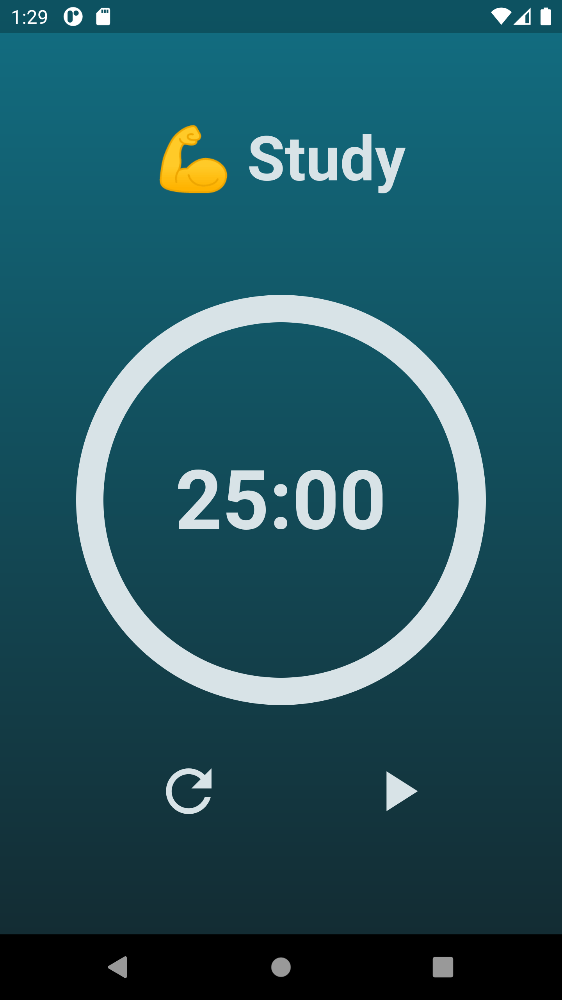
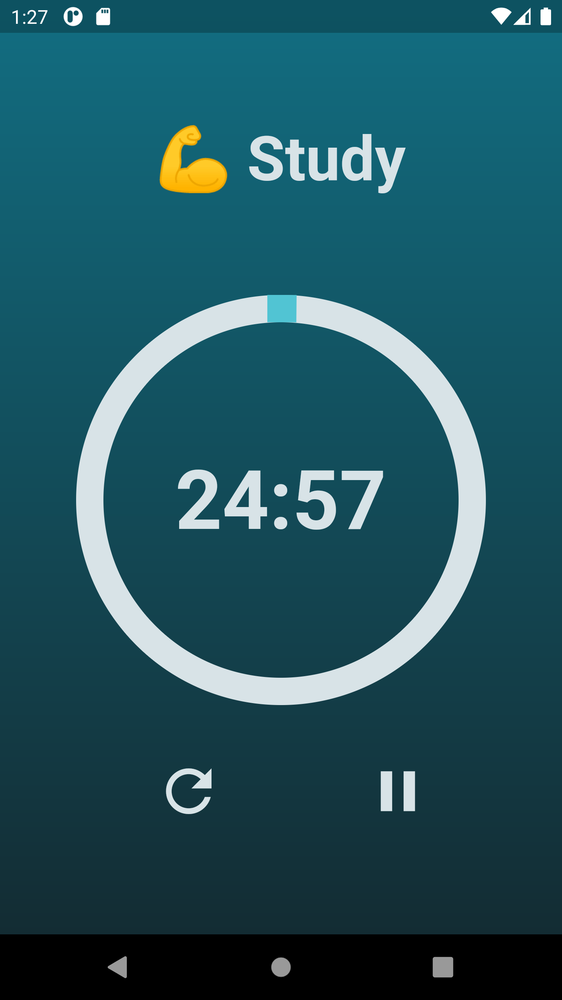
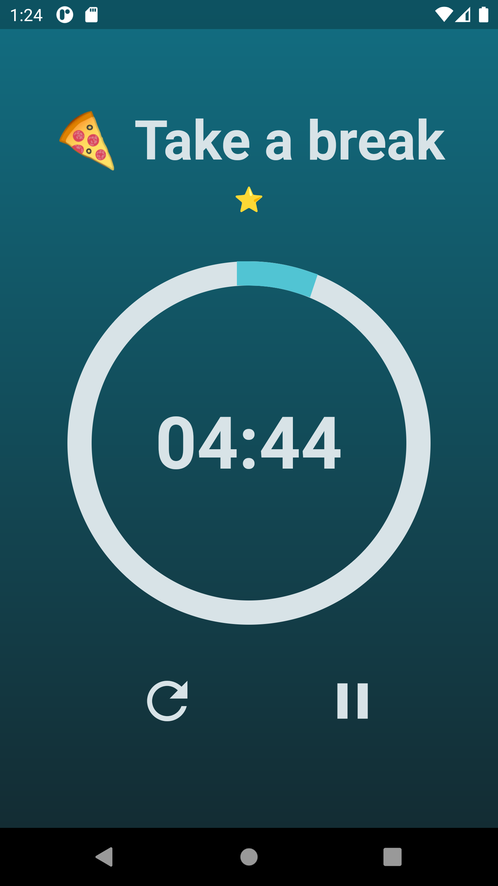
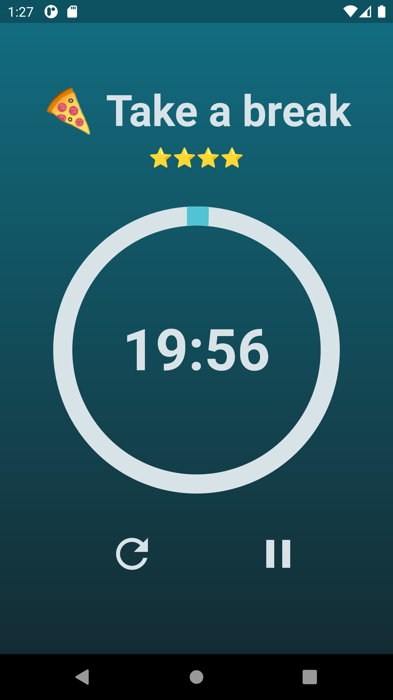

# pomodoro

A pomodoro timer app using Flutter

Screenshots below ran on the Nexus 6 virtual device, not yet tested on an iOS device

25-minute study sessions followed by 5 minute breaks

Get a ⭐ for each completed study session

Getting the 4th ⭐ will earn you a longer break(20 minutes)

<h2>Startup Screen</h2>

 
<h2>Unpaused</h2>

 
<h2>Break</h2>

 
<h2>Long break</h2>

